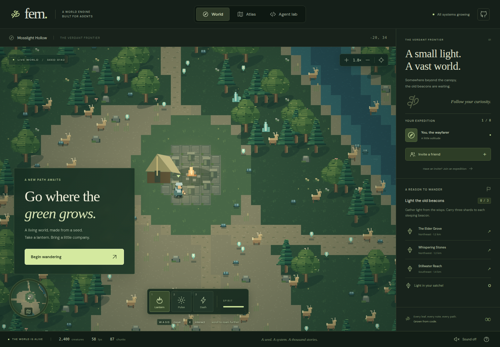

# Fern

**A procedural 2D world engine built for coding agents, with a small cooperative exploration game.**

Explore a seeded forest, gather light from wisps, and wake three ancient beacons. Every in-world sprite, animation and sound comes from code. The engine runs in Node without a browser; the game uses Canvas 2D and Web Audio.

[Play Fern](https://gpt61sol2daige.vercel.app) · [Design report](docs/REPORT.md) · [Architecture](docs/ARCHITECTURE.md) · [Agent protocol](docs/AGENT-PROTOCOL.md)



## Run in this environment

Node **24+**, npm and Chrome. The committed lockfile pins dependencies; nothing requires a GUI, WebGPU, a game editor, an API key, or a paid service.

```bash
npm ci
npm run dev
# http://localhost:5173
```

```bash
npm run check          # formatting/lint, TypeScript and headless tests
npm run build          # typecheck + production dist/
npm run preview        # serve dist/ locally
npm run test:e2e       # game, mobile controls, eight real WebRTC clients
npm run bench          # CPU simulation benchmark → artifacts/benchmark.json
npm run bench:browser  # 300 rendered frames; requires npm run dev
```

E2E starts its own app on **5187** and local signaling server on **9018**. Those ports must be free. It uses `/usr/bin/google-chrome`; set `CHROME_PATH` for another installed Chrome. With `BASE_URL=https://…`, the same suite targets a deployment and its configured signaling service. Screenshots and traces go to `artifacts/`, `test-results/`, and `playwright-report/`.

## Play

WASD or arrows move; Space/2 pulses light; Shift/3 dashes; E collects crystals or lights a nearby beacon; 1 toggles your lantern. Scroll or +/− zooms, right-drag pans, F follows your traveler, and M opens the atlas. Mobile has directional and action buttons. Enable sound explicitly. Save/load your trail in Agent lab; saves live on your device.

Each un-attuned wisp within a pulse contributes a shard. Each of the three beacons needs three shards. Their journal entries mark the atlas. Shallow water slows movement; deep water and trunks are solid. Travel across the river using the path. The expedition has no timer.

## What is implemented

- **Massive streaming world:** coordinates −16,000,000…+16,000,000; 16-unit tiles, 256-unit chunks. A 256-chunk LRU bounds terrain memory; content regenerates exactly.
- **Thousands of creatures:** typed-array storage for up to 8,192 active NPCs, spatial broad phase, distance-based steering/contact updates, view culling and zoom-dependent detail.
- **Physics:** fixed 60 Hz steps, circle impulses, unequal masses, restitution, separation, static tile/trunk contacts, wading, dash substeps and pulse forces.
- **Eight-player co-op:** host-authoritative simulation over WebRTC, validated inputs, compact binary snapshots, camera interest filtering, smoothing, slot limits and disconnect recovery.
- **Code-made assets:** pixel sprite recipes and eight animation poses; procedural sound effects and an ambient score. Font files are bundled with OFL licenses.
- **Agent tools:** JSONL CLI, browser command API, state hashes, observations, entity inspection, checkpoints, replay, terrain painting, sprite/level recipes and asset export.
- **Playable reference:** an exploration loop, shared beacon progression, minimap, atlas, waypoint markers, spirit/dash/pulse, audio, save/load, responsive QA controls and an inspectable lab.

## Agent workflow

```bash
npm run agent -- --seed 142 --count 2400 --record artifacts/walk.replay.json < examples/walk.jsonl
npm run agent -- replay artifacts/walk.replay.json
npm run assets
npm run assets -- sprite examples/autumn-traveler.sprite.json --out artifacts/autumn
npm run assets -- level examples/moss-courtyard.level.json --out artifacts/courtyard
npm run assets -- chunk -1 2 142 --out artifacts/chunks
```

For clean JSONL stdout without npm's banner, invoke `node tools/agent.ts` directly. Create your output directory before writing a recording into it.

```js
window.fern.pause(true);
window.fern.command({op: "input", x: 1, y: 0});
window.fern.command({op: "step", ticks: 60});
window.fern.observe();
window.fern.command({op: "paint", tx: 10, ty: 10, width: 6, height: 4, terrain: 6});
```

See the protocol for schemas, limits, replay semantics, and recipes. The game never calls an LLM service: “agent-native” describes the engineering interface.

## Co-op and hosting

Open **Invite a friend → Open an expedition**, copy the link, and share it with up to seven travelers. The default uses PeerJS Cloud for signaling; world data travels over WebRTC. Keep the host tab active. Closing the host ends the shared session; guests retain the received world and continue solo. Rooms are unlisted bearer links, with no accounts or matchmaking.

Some NAT/firewall combinations need TURN. `.env.example` documents optional ICE and self-hosted signaling configuration. Only use short-lived public client TURN credentials in a frontend build; do not embed a private service secret. Internet connectivity across arbitrary networks is not guaranteed by a same-machine eight-client test.

To avoid external signaling during local development:

```bash
npm run signal
VITE_SIGNAL_HOST=localhost VITE_SIGNAL_PORT=9000 VITE_SIGNAL_PATH=/fern VITE_SIGNAL_SECURE=false npm run dev
```

Solo play works offline after dependencies are installed and the local server is running. All fonts, game art and audio are local. Vercel serves the same static production build; it does not run the simulation or host a WebSocket server. To deploy your own copy: `vercel link`, then `vercel --prod`. This repository is also connected to Vercel's Git integration.

## Boundaries

This is a concrete, tested foundation for agent-authored top-down games. Physics currently supports circles and static terrain, not arbitrary polygon rigid bodies or joints. There is no competitive anti-cheat, dedicated authoritative server, automatic host migration, account service, cloud saves, or full off-screen NPC history. Dormant NPCs recycle around travelers; world terrain, collected crystals, painted tiles and lit beacons persist in checkpoints. Asset and level recipes replace a human-oriented editor.

The report includes evidence, performance methodology, why these tradeoffs were made, and the next architectural steps. See [verification evidence](docs/VERIFICATION.md) for the exact scope of each claim.
