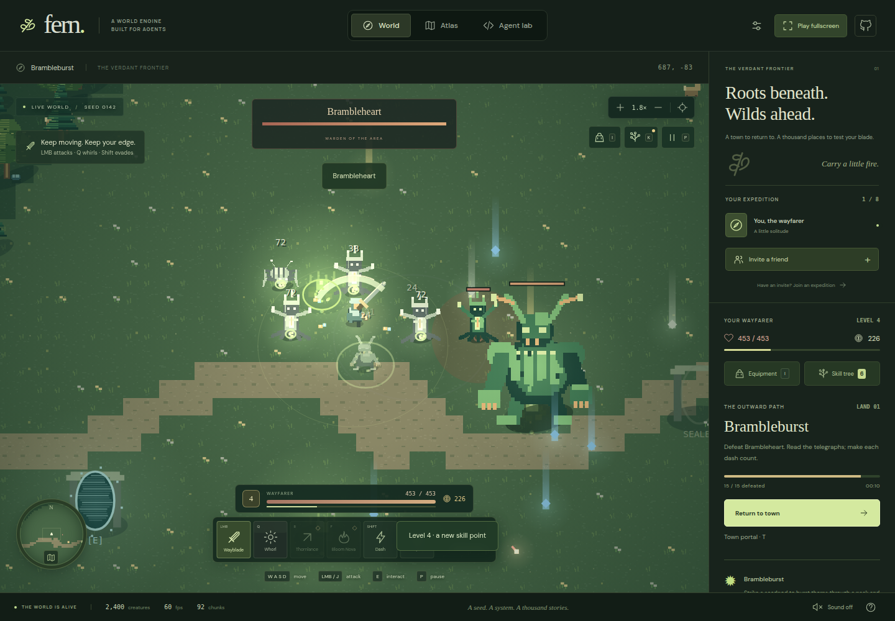

# Fern

**A fast, outward-growing hack-and-slash built on a deterministic, agent-native 2D engine.**

Keep your familiar wayfarer, carve through monster packs, shape a build across four skill paths, and carry your finds to the next town. Eight authored areas introduce optional mechanics; beyond them, seeded encounters combine those mechanics, monster behaviors, layouts and palettes. Every in-world sprite, animation and sound comes from code. Node runs the same simulation headlessly; the browser uses Canvas 2D and Web Audio.

[Play Fern](https://gpt61sol2daige.vercel.app) · [Design report](docs/REPORT.md) · [Architecture](docs/ARCHITECTURE.md) · [Agent protocol](docs/AGENT-PROTOCOL.md)

The [reactive physics implementation plan](docs/physics/README.md) covers twelve milestones. M01–M02 supply a solo Rapier2D playground in **Agent lab**: push/spin real props, launch a swept body, configure land/area/region policies, freeze and re-enable the same bodies, and test prop blocking with a lab contact traveler. Inspect effective values and their sources, queue edits or apply them while paused, and save/replay the scene. M03 moves travelers, monsters, terrain and encounter props into Rapier with regional ambient ownership; M04 carries that physical scene through versioned saves and host-authoritative eight-player co-op. Materials, destruction and mechanisms follow in M05–M12. See [status and handoffs](docs/physics/STATUS.md) for verified progress.



## Run in this environment

Node **24.x**, npm and Chrome (`.node-version` records the tested 24.21.0 runtime). The committed lockfile pins dependencies; nothing requires a GUI, WebGPU, a game editor, an API key, or a paid service.

```bash
npm ci
npm run dev
# http://localhost:5173
```

```bash
npm run check          # formatting/lint, TypeScript and headless tests
npm run build          # typecheck + production dist/
npm run preview        # serve dist/ locally
npm run test:e2e       # combat/build loop, mobile, eight real WebRTC clients
npm run verify:run     # nine areas through real inputs, including two new towns
npm run physics        # reproducible Rapier scene, contacts, snapshot continuation and replay
node tools/physics.ts examples/physics-regions.jsonl # regional switch acceptance and save/replay
npm run bench          # CPU simulation benchmark → artifacts/benchmark.json
npm run bench:browser  # 300 rendered frames; requires npm run dev
npm run bench:quality  # 6k / 16k / 32k / 65,536 creatures in game mode
npm run bench:combat   # 300 close-up combat frames in a generated encounter
```

E2E starts its own app on **5187** and local signaling server on **9018**. Those ports must be free. It uses `/usr/bin/google-chrome`; set `CHROME_PATH` for another installed Chrome. In IPv4-only containers, set `SIGNAL_HOST=0.0.0.0` so the local signaling server does not bind IPv6. With `BASE_URL=https://…`, the same suite targets a deployment and its configured signaling service. Screenshots and traces go to `artifacts/`, `test-results/`, and `playwright-report/`.

## Play

**Begin the hunt** leaves Mosslight Hollow for Brambleburst. Defeat the packs and their warden, collect equipment with **E**, then follow the outward gate. Every fourth area opens a portal to the next land's town. Spend gold with Rowan, refill your flasks with Iona, and travel onward with Orin. Their stalls, gestures and town lighting are procedural.

| Action | Controls |
| --- | --- |
| Move / aim | WASD or arrows / mouse; keyboard attacks auto-aim if the pointer has not aimed |
| Slash combo | Hold left mouse or J |
| Whorl / Thornlance / Bloom Nova | Q or 2 / R or 3 or right mouse / F or 4; unlock the latter two in the tree |
| Dodge / healing flask | Shift or Space / 1 |
| Pick up gear, use a mechanic, talk or travel | E |
| Equipment / skill tree / pause and tuning | I / K / P |
| Recall to town | T; stand still and avoid damage for 2.5 simulation seconds |
| Atlas / recenter / lantern | M / C / L |
| Zoom / pan / fullscreen | Scroll or +/− / middle-drag / G |

Touch controls and the compact fullscreen HUD expose the same actions. Enable sound explicitly. Solo dialogs and the atlas pause the world; co-op keeps running. Save/load in display settings or Agent lab; checkpoints live in IndexedDB on this device. Death takes 10% of carried gold and retains levels, skills and equipment. When party members are still fighting, a fallen player can revive at the trailhead without resetting their encounter.

### Build and progression

**48 skill nodes** span Blade, Ember, Root and Gale, with prerequisite links, rank investment, active ability unlocks, keystones and repeatable mastery. Three starting points let you choose a direction immediately; leveling grants more. Respec in town costs 10 gold per allocated point.

Four equipment slots—weapon, armor, boots and charm—carry deterministic base power, stat affixes and common/magic/rare/legendary rarities. Legendary powers change combat. Wardens guarantee at least rare gear; every fourth area's warden guarantees a legendary. The 40-slot satchel supports comparison, equipping, individual sales and bulk sales of unequipped common/magic gear. XP and gold pickups reward the entire party; equipment goes to its collector.

| Area | Optional advantage |
| --- | --- |
| Brambleburst | Strike pods to burst thorns and root packs |
| Slipstream | Wind lanes grant haste and spirit |
| Stormglass | Hit pylons for chain lightning |
| Echo Wells | Repeat an ability from a nearby well |
| Cinderwake | Cross vents for burning strikes; avoid lingering |
| Bloodbloom | Trade life for damage and bonus XP |
| Gravity Knots | Pull scattered monsters into your area attacks |
| Riftstep | Blink between arches with an arrival shockwave |

Clearing requires combat, never solving a mechanic. Later generated areas combine two or three mechanics and link their effects. Six behavior archetypes, six articulated monster rigs, five palettes and six terrain layouts form the shared content vocabulary. Bosses mix telegraphed attacks and a second phase. The run has no authored endpoint; area indices use safe integers and each new land reuses bounded local coordinates. Runtime collections and visual caches remain capped.

**P → difficulty** exposes an overall slider, Story/Wild/Savage presets, and separate player/enemy damage, health and speed multipliers. Changes affect the running simulation immediately. Encounter preview can jump to any supported area for playtesting. The default challenge is intentionally demanding; the full-run QA controller explicitly uses 2× player damage and health, while a separate test clears the first area at defaults.

### Engine and display

The fixed-step engine retains deterministic replay, complete checkpoints, spatial physics, tile editing and seeded streaming across a ±16-million-unit world. Up to **65,536 ambient creatures** can surround the party; encounters have a separate **100-live-enemy** budget. Ambient wildlife is hidden inside the active combat clearing to keep attacks readable. Local draw distance and wildlife limits never hide combatants, loot or mechanics.

**Settings** offers independent draw distance (256–16,384 units), ambient view limit and world population, with saved presets. Only the host changes shared population and encounter tuning. **Play fullscreen** or **G** uses native fullscreen; the same game layout fills the window when native fullscreen is unavailable. Esc/G restores the workspace. Settings report rendered FPS and actual simulation Hz; high populations can slow both. [Versioned measurements and test scope](docs/VERIFICATION.md) keep old ambient stress results separate from combat measurements.

The original beacon, crystal and wildlife interactions remain available as engine examples. The adventure HUD focuses on the outward run.

## Agent workflow

```bash
npm run agent -- --seed 142 --count 2400 --record artifacts/walk.replay.json < examples/walk.jsonl
npm run agent -- replay artifacts/walk.replay.json
npm run assets
npm run assets -- sprite examples/autumn-traveler.sprite.json --out artifacts/autumn
npm run assets -- level examples/moss-courtyard.level.json --out artifacts/courtyard
npm run assets -- chunk -1 2 142 --out artifacts/chunks
npm run adventure -- area 25 142
npm run adventure -- validate artifacts/adventure/area-25.json
npm run adventure -- rig examples/glass-warden.rig.json
npm run verify:run
```

For clean JSONL stdout without npm's banner, invoke `node tools/agent.ts` directly. Create your output directory before writing a recording into it.

```js
window.fern.pause(true);
window.fern.command({op: "input", x: 1, y: 0});
window.fern.command({op: "step", ticks: 60});
window.fern.game.observe();
window.fern.command({op: "paint", tx: 10, ty: 10, width: 6, height: 4, terrain: 6});
```

Use `catalog` to inspect all game registries, `adventure` for validated player actions, and `encounter` for area/recipe previews. See the protocol for schemas, limits, replay semantics, and recipes. The game never calls an LLM service: “agent-native” describes the engineering interface.

## Co-op and hosting

Open **Invite a friend → Open an expedition**, copy the link, and share it with up to seven travelers. The default uses PeerJS Cloud for signaling; world data travels over WebRTC. Keep the host tab active. Closing the host ends the shared session; guests retain the received world and continue solo. Rooms are unlisted bearer links, with no accounts or matchmaking. The host controls the shared route; guests learn skills, buy/equip items and fight through validated actions. Joining creates a session build at the party's catch-up level, not an account import. Leaving preserves that local build for solo continuation; save it on your device.

Some NAT/firewall combinations need TURN. `.env.example` documents optional ICE and self-hosted signaling configuration. Only use short-lived public client TURN credentials in a frontend build; do not embed a private service secret. Internet connectivity across arbitrary networks is not guaranteed by a same-machine eight-client test.

To avoid external signaling during local development:

```bash
npm run signal
VITE_SIGNAL_HOST=localhost VITE_SIGNAL_PORT=9000 VITE_SIGNAL_PATH=/fern VITE_SIGNAL_SECURE=false npm run dev
```

Solo play works offline after dependencies are installed and the local server is running. All fonts, game art and audio are local. Vercel serves the same static production build; it does not run the simulation or host a WebSocket server. To deploy your own copy: `vercel link`, then `vercel --prod`. This repository is also connected to Vercel's Git integration.

## Boundaries

This is a concrete, tested foundation for agent-authored top-down games. Physics currently supports circles and static terrain, not arbitrary polygon rigid bodies or joints. There is no competitive anti-cheat, dedicated authoritative server, automatic host migration, account service, cloud saves, or full off-screen NPC history. Dormant NPCs recycle around travelers; world terrain, collected crystals, painted tiles and lit beacons persist in checkpoints. Asset and level recipes replace a human-oriented editor.

The report includes evidence, performance methodology, why these tradeoffs were made, and the next architectural steps. See [verification evidence](docs/VERIFICATION.md) for the exact scope of each claim.
